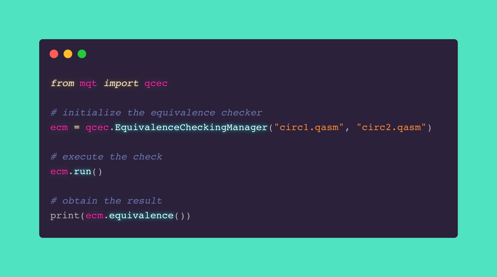

<h1>QCEC - A tool for Quantum Circuit Equivalence Checking</h1>

---

A tool for Quantum Circuit Equivalence Checking developed by the
<a href='https://iic.jku.at/eda/'>Institute for Integrated Circuits</a> at the <a href='https://jku.at'>Johannes Kepler University Linz</a> based on methods proposed in:

---

<h2>Quick Links</h2>

---

<h2>Project Status</h2>

 

---

If you have any questions, feel free to contact us via <a href='mailto:iic-quantum@jku.at'>iic-quantum@jku.at</a> or by creating an issue on <a href='https://github.com/iic-jku/qcec/issues'>GitHub</a>.

